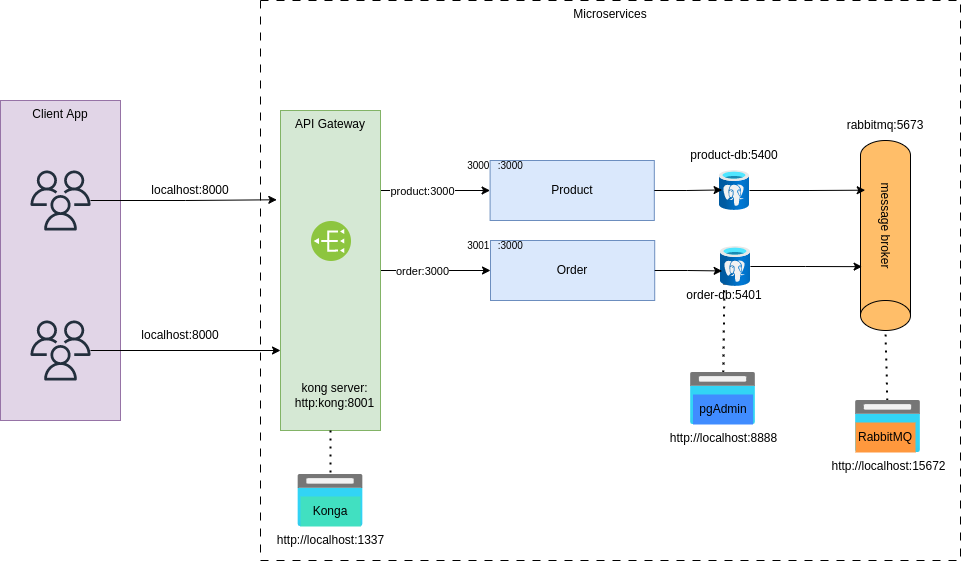

## Micro-service example


In this project we create two services:

1- micro-product

2- micro order

Each micro-service has its own database (Postgres DB). The micro-services are connected to each other using RabbitMQ.

# How to start
To start the project, you need Docker (version 20 or newer) and docker-compose (version 1.29 or newer)

For using Docker in Iran [set a proxy](https://docs.google.com/document/d/1A4l8gan1_Rn0C3-dkGxbKsqCbcFxVbzF5EikM03fkdA/edit):
```
sudo nano /etc/docker/daemon.json
```
```
{
"registry-mirrors": ["https://registry.docker.ir"]
}
```

Maybe the npm install can not work on you system
1- Turn on VPN
```
cd micro-order
npm i
```

```
cd micro-product
npm i
````

In main route project:
```
make dbuild
```


## Gateway


Note: Please stop the Postgres service on your system because the database gateway uses port 5432.


```
sudo systemctl stop postgres.service
```
### For running Kong gateway
After that

```
cd gateway
docker-compose up
```


## useful links:

#### pgAdmin: 

Link: http://localhost:8888/
```
username: m.y.ahmadi22@gmail.com
password: postgres
```

##### Register a server


<hr>

#### RabbitMQ

Link: http://localhost:15672/
```
username: guest
password: guest
```


<hr>

Kong


Link: 

http://localhost:1337

1- sing up

2- register the kong server


3- Add micro-product service


4- Add micro-order service


5- Add routes to each services

##### product
```
path: /api/products 
method: GET, POST
```
Note: Press Enter key to insert new method or paths


##### order
```
path: /api/products 
method: GET, POST
```

